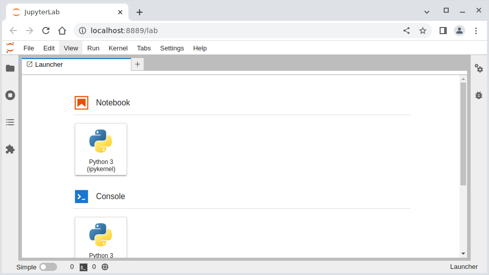
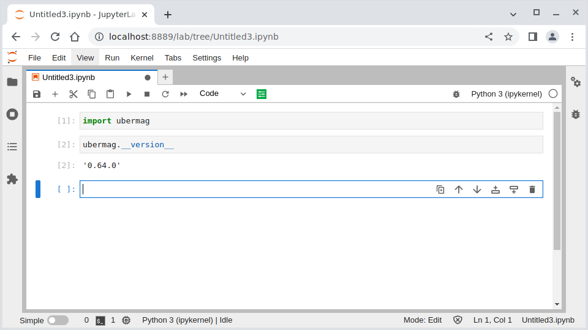

===========
Jupyter lab
===========

We use Jupyter notebooks for all our examples and recommend using Jupyter
notebooks for interactive simulations where the computation time is tolerable.
For details please refer to https://jupyter.org. Here, we provide a minimal
introduction to starting and using a Jupyter notebook. We will use the newer
interface, called "Jupyter lab". We assume that you have locally installed
Ubermag or any of its subpackages as explained in :doc:`../installation`.
Jupyter lab is automatically installed as a dependency of ``discretisedfield``.

To start Jupyter lab, open the Anaconda prompt (Windows) or a terminal (MacOS
and Linux) and run the following commands (if you use pip+venv instead of conda
activate the environment as explained in the installation instructions):

.. code-block:: bash

   $ conda activate ubermag_env  # replace with your environment name
   $ jupyter lab

This will automatically open a new browser window and start Jupyter lab in
it. Jupyter lab gives you full access to your files in the directory (and
all subdirectories) from where you start it.

Once you have started Jupyter lab, you will see a browser tab similar to this
one (note that the UI might change over time).

Click on "Notebook: Python 3" to start a new Python notebook. You can import the
``ubermag`` meta-package and check the installed version as shown in the
following screenshot.

Please refer to the Jupyter documentation or other tutorials available online to
learn more about the Jupyter lab and Jupyter notebooks.
