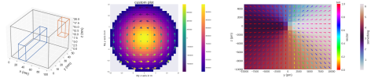
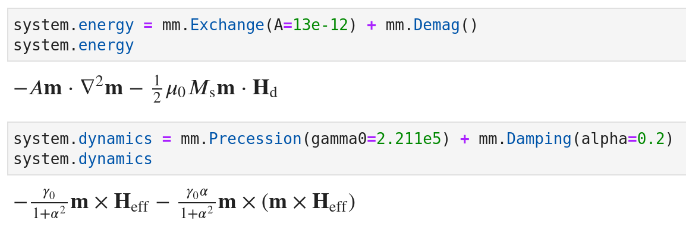
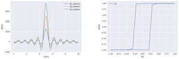
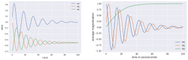
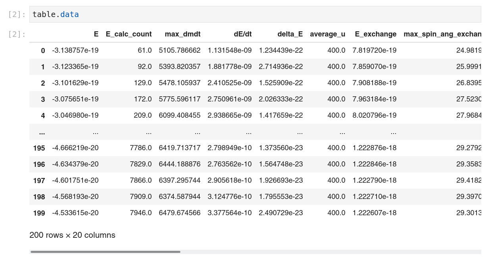
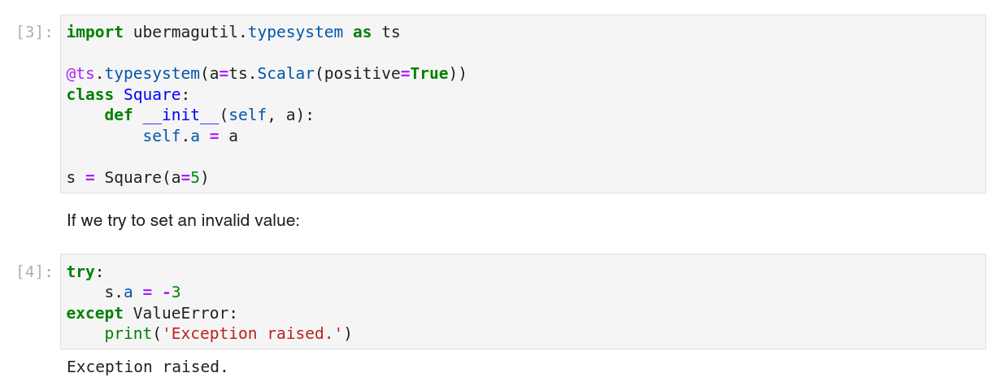

Ubermag -- Features and packages
===============================

Ubermag is a collection of several independent packages that can be used
independently as well as in combination. The whole set of packages -- the
``ubermag`` meta-package -- is tight to micromagnetic simulations. The
individual sub-packages can be used in other fields, e.g. fluid dynamics.

Finite-difference fields -- ``discretisedfield``
------------------------------------------------

- Three-dimensional finite-different scalar or vector fields independent of the underlying physics
- It provides common field operations such as

  - Mathematical operations (standard operations, derivatives, integration, ...)
  - Specific tools, e.g. topological charge density (``discretisedfield.tools``)
  - Visualisation with ``matplotlib`` and ``k3d``
  - Reading and writing ``vtk``, ``ovf``, and ``hdf5`` files

- Possible applications are amongs others

  - Micromagnetics
  - Fluid dynamics

Micromagnetic problem description -- ``micromagneticmodel``
-----------------------------------------------------------

- Physics of the micromagnetic system
- Energy equation (Exchange energy, Zeeman energy, DMI, ...)
- Dynamics equation (damping, precession, currents, ...)

OOMMF-based micromagnetic simulations -- ``oommfc``
---------------------------------------------------

- An Object Oriented MicroMagnetic Framework OOMMF calculator for computational
  magnetism models defined with ``micromagneticmodel``

Analysis of micromagnetic simulations -- ``micromagneticdata``
--------------------------------------------------------------

   

Reading scalar simulation data files -- ``ubermagtable``
-------------------------------------------------------

- Reading scalar data files (OOMMF ``.odt`` and mumax3 ``.txt``)
- Merging multiple tables
- Visualisation of scalar table data

``micromagnetictests``
----------------------

- tests for ``oommfc``

Typesystem and utilities -- ``ubermagutil``
------------------------------------------

- Definition of typesystem descriptors and decorators
- Documentation inheritance decorators
- Determining SI prefixes
- Various convenience functions

Simulations of experimental measurements -- ``mag2exp``
------------------------------------------------------

.. image:: _static/mag2exp-examples.svg

- Simulations of experimental techniques used to study magnetism
- Provides techniques such as

  - Lorentz Transmission Electron Microscopy
  - Magnetic Force Microscopy
  - DC and Torque Magnetometry
  - X-ray Holography
  - Small Angle X-ray Scattering
  - Small Angle Neutron Scattering
  - Magneto-Optical Kerr Effect Microscopy

What is ``ubermag``?
--------------------

As a whole, ``ubermag`` is a level of (Python) utilities sitting above ("*über*")
existing micromagnetic simulation packages, such as OOMMF and mumax3. We refer
to packages such as OOMMF and mumax3 as the *computational backends*, or as
(micromagnetic) *calculators*.

By exposing micromagnetic simulations to the Python ecosystem and integration
into Jupyter, all the popular tools used in scientific computing for data
analysis, numerical analysis, visualisation, machine learning, etc. become
readily available.

The ``ubermag`` Python packages allow to specify a micromagnetic problem (without
making use of any micromagnetic calculator). Only when the micromagnetic problem
needs to be solved, the task is delegated to the computational backend.

Design objectives of Ubermag are:

1. Work towards a common interface (domain spacific language) to multiple simulation packages,

2. Expose micromagnetic simulations to Python ecosystem,

3. Make it easier to compare simulation results obtained with different simulation packages, and

4. Allow execution of micromagnetic simulation in the cloud.

.. figure:: _static/interoperability.png

   Magnetic systems (left-to-right): `Skyrmions
   <https://github.com/lang-m/ubermag-skyrmion-demo>`__, vortex, Bloch point
   [renderings created with Blender]

Documentation and tutorials
===========================

The examples shown in `quickstart <quickstart.html>`__ and the `workshop
<workshop/index.html>`__ are tight to micromagnetic simulations.
Only the more commonly used features are covered in there.
`Documentation <documentation/index.html>`__ and `API
Reference <api/index.html>`__ provide the full documentation for the
individual packages.

If you are new and plan to use Ubermag for micromagnetic simulations please
start with the `workshop <workshop/index.html>`__ or the `quickstart
<quickstart.html>`__ example.

Otherwise, please directly refer to the `documentation 
<documentation/index.html>`__ or the `API reference <api/index.html>`__.

``ubermag`` in the cloud
========================

If you do not want to install `ubermag` on your machine, you can use it in the
cloud via Binder. This does not require you to have anything installed on your
machine and no files will be created. To access it, please use the following
badge:

.. image:: https://mybinder.org/badge_logo.svg
   :target: https://mybinder.org/v2/gh/ubermag/ubermag/stable?urlpath=lab/tree/docs/index.ipynb

You can setup your own simulation from scratch or upload the notebook you
prepared previouly. Please remember to download the notebook after you are done,
so that you can upload it again when you start a new online session.

Authors
=======

Marijan Beg\ :sup:`1, 2`, Martin Lang\ :sup:`2, 3`, Samuel Holt\ :sup:`2, 4`,
Ryan A. Pepper\ :sup:`2`, Thomas Kluyver\ :sup:`5`, James Loudon\ :sup:`6`,
Thomas Hicken\ :sup:`7`, David Cortés Ortuño\ :sup:`2`, Jeroen Mulkers\
:sup:`8`, Jonathan Leliaert\ :sup:`8`, and Hans Fangohr\ :sup:`2, 3, 9`

- :sup:`1` Department of Earth Science and Engineering, Imperial College London,
  London SW7 2AZ, United Kingdom
- :sup:`2` Faculty of Engineering and Physical Sciences, University of
  Southampton, Southampton SO17 1BJ, United Kingdom
- :sup:`3` Max Planck Institute for the Structure and Dynamics of Matter,
  Luruper Chaussee 149, 22761 Hamburg, Germany
- :sup:`4` Department of Physics, University of Warwick, Coventry CV4 7AL,
  United Kingdom
- :sup:`5` European XFEL GmbH, Holzkoppel 4, 22869 Schenefeld, Germany
- :sup:`6` Department of Materials Science and Metallurgy, University of
  Cambridge, Cambridge, CB3 0FS, United Kingdom
- :sup:`7` Department of Physics, Durham University, Durham, DH1 3LE, United
  Kingdom
- :sup:`8` Faculty of Sciences, Ghent University, Krijgslaan 281, S12, 9000
  Ghent, Belgium
- :sup:`9` Center for Free-Electron Laser Science, Luruper Chaussee 149, 22761
  Hamburg, Germany.

How to cite
===========

If you use Ubermag or any of its sub-packages for your research please cite:

M. Beg, M. Lang and H. Fangohr, "Ubermag: Toward More Effective Micromagnetic
Workflows," in IEEE Transactions on Magnetics, vol. 58, no. 2, pp. 1-5, Feb.
2022, Art no. 7300205, doi: `10.1109/TMAG.2021.3078896
<https://doi.org/10.1109/TMAG.2021.3078896>`__.

.. code-block:: bib

   @article{beg2022,
     author = {Beg, Marijan and Lang, Martin and Fangohr, Hans},
     journal = {IEEE Transactions on Magnetics},
     title = {Ubermag: Towards more effective micromagnetic workflows},
     year = {2022},
     volume = {58},
     number = {2},
     pages = {1-5},
     doi = {10.1109/TMAG.2021.3078896}
   }

License
=======

Licensed under the BSD 3-Clause “New” or “Revised” License. For details, please refer to the LICENSE file.

Acknowledgements
================

Ubermag is a part of the Horizon 2020 European Research Infrastructure
`OpenDreamKit <https://opendreamkit.org>`__ project (Project ID 676541). This work was supported by the Fonds
Wetenschappelijk Onderzoek (FWO-Vlaanderen) through Project No. G098917N (Jeroen
Mulkers) and with a postdoctoral fellowship (Jonathan Leliaert).

.. toctree::
   :maxdepth: 1
   :hidden:

   installation
   quickstart
   workshop/index
   documentation/index
   api/index
   changelog
   help

