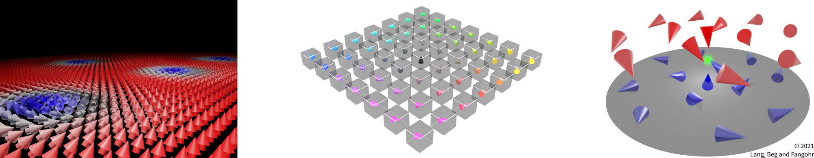

.. meta::
   :description: Ubermag drives micromagnetic simulations described in Python
                 from the Jupyter notebook, including problem description,
                 numerical solving (using existing packages such as OOMMF), and
                 data analysis.
   :keywords: micromagnetics, micromagnetism, micromagnetic simulation, ubermag,
              ubermagutil, ubermagtable, discretisedfield, micromagneticmodel,
              micromagneticdata, micromagnetictests, oommfc, oommf, mag2exp,
              magnetism, finite differences, Lorentz transmission electron
              microscopy, LTEM, small-angle Neutron scattering, SANS, small
              angle x-ray scattering, SAXS, magnetic force microscopy, MFM,
              torque magnetometry, DC magnetometry X-ray holography,
              reproducibility

=======
Ubermag
=======

With ``ubermag`` you can drive your micromagnetic simulations from the Jupyter
notebook. A single notebook can contain problem description, numerical solving,
and data analysis in a self-consistent fashion. Using Python ``ubermag`` defines
a domain-specific language to describe micromagnetic problems and automatically
communicates with low-level simulation tools such as OOMMF.

.. button-link:: https://mybinder.org/v2/gh/ubermag/tutorials/latest?urlpath=lab/tree/demo.ipynb
   :color: warning
   :shadow:

   **Try it in your browser**

Features and packages
=====================

.. image:: https://anaconda.org/conda-forge/ubermag/badges/version.svg
    :target: https://anaconda.org/conda-forge/ubermag

.. image:: https://anaconda.org/conda-forge/ubermag/badges/latest_release_date.svg
    :target: https://anaconda.org/conda-forge/ubermag

Ubermag is a collection of several independent Python packages that can be used
independently as well as in combination. The whole set of packages -- the
``ubermag`` meta-package -- is taylored to micromagnetic simulations. The
individual sub-packages can be used in other fields, e.g. fluid dynamics.

.. grid:: 1 1 2 2
   :gutter: 3

   .. grid-item-card:: ``discretisedfield``
      :img-top: _static/field-examples.svg

      Finite-differenc scalar and vector fields

      - common mathematical operations
      - domain-specific tools (e.g. topological charge)
      - reading and writing ``vtk``, ``ovf``, and ``hdf5``
      - Visualisation with ``matplotlib`` and ``k3d``

   .. grid-item-card:: ``micromagneticmodel``
      :img-top: _static/micromagneticmodel.png

      Physics of the micromagnetic system

      - Energy equation (Exchange, Zeeman, DMI, ...)
      - Dynamics equation (damping, precession, ...)

   .. grid-item-card:: ``oommfc``
      :img-top: _static/oommfc-examples.svg

      An Object Oriented MicroMagnetic Framework OOMMF calculator for computational
      magnetism models defined with ``micromagneticmodel``

   .. grid-item-card:: ``mag2exp``
      :img-top: _static/mag2exp-examples.svg

      Simulations of experimental techniques used to study magnetism such as

      - Lorentz Transmission Electron Microscopy
      - Magnetic Force Microscopy
      - X-ray Holography
      - Small Angle Neutron Scattering

   .. grid-item-card:: ``micromagneticdata``
      :img-top: _static/analysis-examples.svg

      Analysis of micromagnetic simulations

   .. grid-item-card:: ``ubermagtable``
      :img-top: _static/ubermagtable.png

      - Reading scalar data files (OOMMF ``odt`` and mumax3 ``txt``)
      - Merging multiple tables
      - Visualisation of scalar table data

   .. grid-item-card:: ``micromagnetictests``

      Tests for micromagnetic calculators in ``ubermag`` (currently only ``oommfc``)

   .. grid-item-card:: ``ubermagutil``

      - Definition of typesystem descriptors and decorators
      - Determining SI prefixes
      - Various convenience functions

What is ``ubermag``?
--------------------

As a whole, ``ubermag`` is a level of (Python) utilities sitting above ("*über*")
existing micromagnetic simulation packages, such as OOMMF and mumax3. We refer
to packages such as OOMMF and mumax3 as the *computational backends*, or as
(micromagnetic) *calculators*.

By exposing micromagnetic simulations to the Python ecosystem and integration
into Jupyter, all the popular tools used in scientific computing for data
analysis, numerical analysis, visualisation, machine learning, etc. become
readily available.

The ``ubermag`` Python packages allow to specify a micromagnetic problem (without
making use of any micromagnetic calculator). Only when the micromagnetic problem
needs to be solved, the task is delegated to the computational backend.

Design objectives of Ubermag are:

1. Work towards a common interface (domain spacific language) to multiple simulation packages,

2. Expose micromagnetic simulations to Python ecosystem,

3. Make it easier to compare simulation results obtained with different simulation packages, and

4. Allow execution of micromagnetic simulation in the cloud.

   Magnetic systems (left-to-right): `Skyrmions
   <https://github.com/lang-m/ubermag-skyrmion-demo>`__, vortex, Bloch point
   [renderings created with Blender]

Documentation and tutorials
===========================

If you are new to ``ubermag`` you should consider first looking at
:doc:`getting-started/index` which will give a gentle introduction into all
the packages inside ``ubermag``.

If you already know the basics of ``ubermag`` there is a collection of
:doc:`examples/index` that show how to solve particular (physical) questions
using ``ubermag`` and its subpackages. For a documentation of more technical
functionality of the different packages please refer to the
:doc:`documentation/index` and the :doc:`api/index`.

An online-workshop has been given in June 2020 for spintalks (spintalks.org),
supported by IEEE Magnetics Society (ieeemagnetics.org). A recording of these
sessions is available on `YouTube
<https://youtube.com/channel/UC7MSqVQSMFV42R1jAYmKGLg>`__. Please note that some
functionality in Ubermag has been changed and extended since the workshop
recording.

``ubermag`` in the cloud
========================

If you do not want to install ``ubermag`` on your machine, you can use it in the
cloud via Binder. This does not require you to have anything installed on your
machine and no files will be created. To access it, please use the following
badge:

.. raw html to open binder in a new tab
.. raw:: html

   

You can setup your own simulation from scratch or upload the notebook you
prepared previouly. Please remember to download the notebook after you are done,
so that you can upload it again when you start a new online session.

Authors
=======

Marijan Beg\ :sup:`1, 2`, Martin Lang\ :sup:`2, 3`, Samuel Holt\ :sup:`2, 4`,
Ryan A. Pepper\ :sup:`2`, Thomas Kluyver\ :sup:`5`, James Loudon\ :sup:`6`,
Thomas Hicken\ :sup:`7`, David Cortés Ortuño\ :sup:`2`, Jeroen Mulkers\
:sup:`8`, Jonathan Leliaert\ :sup:`8`, and Hans Fangohr\ :sup:`2, 3, 9`

- :sup:`1` Department of Earth Science and Engineering, Imperial College London,
  London SW7 2AZ, United Kingdom
- :sup:`2` Faculty of Engineering and Physical Sciences, University of
  Southampton, Southampton SO17 1BJ, United Kingdom
- :sup:`3` Max Planck Institute for the Structure and Dynamics of Matter,
  Luruper Chaussee 149, 22761 Hamburg, Germany
- :sup:`4` Department of Physics, University of Warwick, Coventry CV4 7AL,
  United Kingdom
- :sup:`5` European XFEL GmbH, Holzkoppel 4, 22869 Schenefeld, Germany
- :sup:`6` Department of Materials Science and Metallurgy, University of
  Cambridge, Cambridge, CB3 0FS, United Kingdom
- :sup:`7` Department of Physics, Durham University, Durham, DH1 3LE, United
  Kingdom
- :sup:`8` Faculty of Sciences, Ghent University, Krijgslaan 281, S12, 9000
  Ghent, Belgium
- :sup:`9` Center for Free-Electron Laser Science, Luruper Chaussee 149, 22761
  Hamburg, Germany.

How to cite
===========

If you use Ubermag or any of its sub-packages for your research please cite:

M. Beg, M. Lang and H. Fangohr, "Ubermag: Toward More Effective Micromagnetic
Workflows," in IEEE Transactions on Magnetics, vol. 58, no. 2, pp. 1-5, Feb.
2022, Art no. 7300205, doi: `10.1109/TMAG.2021.3078896
<https://doi.org/10.1109/TMAG.2021.3078896>`__.

.. code-block:: bib

   @article{beg2022,
     author = {Beg, Marijan and Lang, Martin and Fangohr, Hans},
     journal = {IEEE Transactions on Magnetics},
     title = {Ubermag: Towards more effective micromagnetic workflows},
     year = {2022},
     volume = {58},
     number = {2},
     pages = {1-5},
     doi = {10.1109/TMAG.2021.3078896}
   }

License
=======

Licensed under the BSD 3-Clause “New” or “Revised” License. For details, please
refer to the `LICENSE file
<https://github.com/ubermag/ubermag/blob/master/LICENSE>`__.

Acknowledgements
================

Ubermag is a part of the Horizon 2020 European Research Infrastructure
`OpenDreamKit <https://opendreamkit.org>`__ project (Project ID 676541). This
work was supported by the Fonds Wetenschappelijk Onderzoek (FWO-Vlaanderen)
through Project No. G098917N (Jeroen Mulkers) and with a postdoctoral fellowship
(Jonathan Leliaert).

.. toctree::
   :hidden:
   :maxdepth: 1

   installation
   demo
   getting-started/index
   examples/index
   documentation/index
   api/index
   changelog
   help

